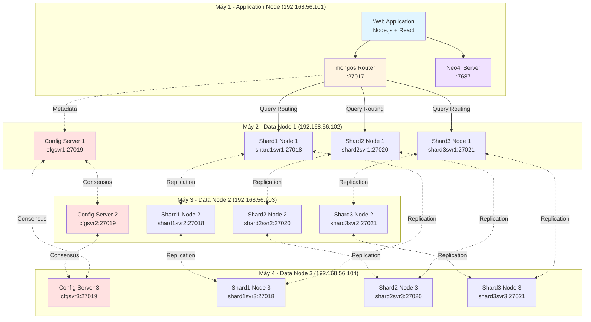

Collecting workspace information# PHẦN 3. CƠ CHẾ HOẠT ĐỘNG PHÂN TÁN

## 3.1. Kiến trúc Triển khai Vật lý (Physical Topology)

Dựa trên PRODUCTION_SETUP.md và ARCHITECTURE.md, hệ thống được triển khai theo mô hình **4 nodes vật lý** với cấu trúc phân tầng rõ ràng giữa tầng ứng dụng (Application Layer) và tầng dữ liệu (Data Layer).

### 3.1.1. Cấu trúc triển khai chi tiết

**Máy 1 (Application Node):**
- **Vai trò:** Tầng ứng dụng và điều phối truy vấn.
- **Thành phần:**
  - **Web Application Server:** Node.js Express backend và React frontend.
  - **MongoDB Router (`mongos`):** Điểm truy cập duy nhất cho client, chịu trách nhiệm định tuyến (routing) các query đến đúng shard dựa trên shard key.
  - **Neo4j Server:** Cơ sở dữ liệu đồ thị phục vụ truy vấn mạng xã hội.
- **Địa chỉ:** `192.168.56.101:27017` (mongos), `192.168.56.101:7687` (Neo4j Bolt).

**Máy 2 (Data Node 1):**
- **Vai trò:** Node dữ liệu đầu tiên trong Replica Set.
- **Thành phần:**
  - **Config Server:** `cfgsvr1` (port 27019) - Thành viên thứ nhất của Config Server Replica Set.
  - **Shard 1 Node:** `shard1svr1` (port 27018) - Primary/Secondary của Shard 1.
  - **Shard 2 Node:** `shard2svr1` (port 27020) - Primary/Secondary của Shard 2.
  - **Shard 3 Node:** `shard3svr1` (port 27021) - Primary/Secondary của Shard 3.
- **Địa chỉ:** `192.168.56.102`.

**Máy 3 (Data Node 2):**
- **Vai trò:** Node dữ liệu thứ hai, cấu trúc tương tự Máy 2.
- **Thành phần:**
  - **Config Server:** `cfgsvr2` (port 27019).
  - **Shard 1 Node:** `shard1svr2` (port 27018).
  - **Shard 2 Node:** `shard2svr2` (port 27020).
  - **Shard 3 Node:** `shard3svr2` (port 27021).
- **Địa chỉ:** `192.168.56.103`.

**Máy 4 (Data Node 3):**
- **Vai trò:** Node dữ liệu thứ ba, hoàn thiện Replica Set 3 thành viên.
- **Thành phần:**
  - **Config Server:** `cfgsvr3` (port 27019).
  - **Shard 1 Node:** `shard1svr3` (port 27018).
  - **Shard 2 Node:** `shard2svr3` (port 27020).
  - **Shard 3 Node:** `shard3svr3` (port 27021).
- **Địa chỉ:** `192.168.56.104`.

### 3.1.2. Sơ đồ kiến trúc phân tán



### 3.1.3. Phân tích tính sẵn sàng cao (High Availability)

Thiết kế này đảm bảo **zero single point of failure** thông qua các cơ chế:

1. **Replica Set trải đều trên 3 máy:** Mỗi shard có 3 replica trải trên 3 máy vật lý khác nhau. Khi một máy chết, 2 máy còn lại vẫn đủ để bầu chọn Primary mới (quorum = 2/3).

2. **Config Server Replica Set:** Metadata của cluster (shard key ranges, chunk distribution) được sao chép 3 bản. Hệ thống chịu được lỗi tối đa 1 Config Server mà vẫn hoạt động.

3. **Isolation:** Mỗi MongoDB instance chạy trên port riêng biệt, tránh xung đột tài nguyên và dễ dàng monitoring/debugging.

## 3.2. Chiến lược Phân mảnh (Sharding Strategy)

Dựa trên setup-sharding.js, hệ thống áp dụng **Hashed Sharding** cho tất cả các collection quan trọng.

### 3.2.1. Cấu hình Shard Key

**Collection `users`:**
```javascript
sh.shardCollection("social_network.users", { _id: "hashed" })
```
- **Shard Key:** `{ _id: "hashed" }`
- **Lý do:** ObjectId mặc định của MongoDB có thành phần timestamp, nếu dùng ranged sharding sẽ tạo hotspot trên shard chứa giá trị _id mới nhất (tất cả insert đều vào shard đó). Hashed sharding phá vỡ tính tuần tự này, phân bố đều user mới vào các shard.

**Collection `posts`:**
```javascript
sh.shardCollection("social_network.posts", { authorId: "hashed" })
```
- **Shard Key:** `{ authorId: "hashed" }`
- **Lý do:** 
  - **Data Locality:** Các bài post của cùng một user được phân tán đều (không cluster lại một chỗ).
  - **Write Scalability:** Khi có nhiều user đăng bài cùng lúc, load được spread across shards.
  - **Trade-off:** Query "Lấy tất cả bài viết của user X" phải broadcast đến nhiều shard (scatter-gather). Tuy nhiên, ứng dụng mạng xã hội thường query "Lấy 20 bài mới nhất từ feed" (không filter theo authorId), nên không ảnh hưởng nhiều.

**Collection `comments`:**
```javascript
sh.shardCollection("social_network.comments", { postId: "hashed" })
```
- **Shard Key:** `{ postId: "hashed" }`
- **Lý do:**
  - **Query Pattern:** Truy vấn phổ biến nhất là "Lấy comments của bài post X", shard key này cho phép targeted query (chỉ hit 1 shard).
  - **Write Distribution:** Comments phân tán đều theo post_id, tránh hotspot khi một post viral nhận hàng nghìn comment.

### 3.2.2. Phân tích kỹ thuật: Hashed vs Ranged Sharding

**Lý do chọn Hashed Sharding cho ID-based keys:**

1. **Phân bố đều chunks:**
   - Hashed sharding áp dụng hash function (MD5) lên shard key, tạo ra giá trị ngẫu nhiên trong range `[-∞, +∞]`.
   - MongoDB chia range này thành các chunks đều nhau (mặc định 64MB/chunk).
   - Kết quả: Dữ liệu mới được ghi đều vào tất cả các shards, không có shard nào bị quá tải.

2. **Tránh Hotspot khi ghi tuần tự:**
   - Ranged sharding với ObjectId sẽ dẫn đến tình huống: shard chứa chunk `[ObjectId(timestamp_now), ObjectId(∞)]` nhận 100% write traffic.
   - Hashed sharding phá vỡ tính tuần tự của timestamp, mỗi document mới được "xáo trộn" vào shard ngẫu nhiên.

3. **Trade-off:**
   - **Mất khả năng range query hiệu quả:** Query `{ _id: { $gte: start, $lte: end } }` phải broadcast đến tất cả shards vì hash function phá vỡ locality.
   - **Giải pháp:** Ứng dụng này không có nhu cầu range query trên _id, chủ yếu là point query (`find by _id`) hoặc filter theo trường khác (createdAt, authorId), nên trade-off này chấp nhận được.

### 3.2.3. Chunk Migration và Balancing

MongoDB Balancer tự động di chuyển chunks giữa các shards để đảm bảo:
- Mỗi shard có số lượng chunks xấp xỉ nhau.
- Khi thêm shard mới, chunks được redistributed.

**Cấu hình từ setup-sharding.js:**
```javascript
sh.enableSharding("social_network")
```

Balancer chạy nền (background process), theo dõi chunk distribution và trigger migration khi chênh lệch vượt ngưỡng (threshold = 8 chunks theo mặc định).

## 3.3. Cơ chế Sao chép và Chịu lỗi (Replication & Consensus)

### 3.3.1. Cấu hình Replica Set

Mỗi shard được cấu hình thành một **Replica Set** gồm 3 thành viên:

```javascript
// Ví dụ Shard 1 từ setup-sharding.js
rs.initiate({
  _id: "shard1",
  members: [
    { _id: 0, host: "192.168.56.102:27018", priority: 2 },  // Preferred Primary
    { _id: 1, host: "192.168.56.103:27018", priority: 1 },
    { _id: 2, host: "192.168.56.104:27018", priority: 1 }
  ]
})
```

**Vai trò của các thành viên:**
- **Primary (1 node):** Nhận tất cả write operations, ghi vào oplog (operations log).
- **Secondary (2 nodes):** 
  - Liên tục đồng bộ oplog từ Primary, áp dụng các thay đổi vào dataset của mình.
  - Có thể phục vụ read operations nếu client cấu hình `readPreference`.
  - Tham gia bầu cử (election) khi Primary chết.

**Tham số `priority`:**
- Node có `priority` cao hơn được ưu tiên bầu làm Primary trong quá trình election.
- Máy 2 (`192.168.56.102`) được set `priority: 2` → preferred Primary, giúp dự đoán được topology trong điều kiện bình thường.

### 3.3.2. Cơ chế Bầu chọn (Election) và Failover

MongoDB sử dụng thuật toán đồng thuận dựa trên **Raft protocol** để bầu chọn Primary.

**Quy trình Failover tự động:**

1. **Phát hiện lỗi (Failure Detection):**
   - Các Secondary liên tục gửi heartbeat đến Primary (mặc định mỗi 2 giây).
   - Nếu không nhận được response trong `electionTimeoutMillis` (mặc định 10 giây), Secondary nghi ngờ Primary chết.

2. **Khởi động Election:**
   - Secondary với `priority` cao nhất tự đề cử (self-nomination).
   - Gửi `replSetRequestVotes` command đến các thành viên khác.

3. **Voting và Quorum:**
   - Mỗi thành viên vote cho candidate đầu tiên gửi request (hoặc candidate với `priority` cao hơn nếu có nhiều request đồng thời).
   - Candidate cần nhận được **majority votes** (> N/2) để trở thành Primary.
   - Trong Replica Set 3 thành viên: cần ít nhất 2 votes (bao gồm vote cho chính mình).

4. **Primary mới nhận nhiệm:**
   - Sau khi được bầu, Primary mới bắt đầu nhận write operations.
   - Các Secondary cũ reconnect đến Primary mới và tiếp tục đồng bộ oplog.

5. **Rollback (nếu cần):**
   - Nếu Primary cũ đã ghi một số operations chưa kịp replicate trước khi chết, những operations này sẽ bị rollback khi node đó rejoin cluster.
   - Dữ liệu rollback được lưu vào file riêng để admin xem xét.

**Kiểm chứng từ test-shard-failover.js:**

Dựa trên test-shard-failover.js, script này mô phỏng failure scenario:

```javascript
// Shutdown Primary của Shard 1
db.adminCommand({ shutdown: 1 })

// Chờ election hoàn tất (~ 10-12 giây)
await sleep(12000)

// Verify: Một trong hai Secondary đã trở thành Primary mới
const newStatus = await shard1Client.admin().command({ replSetGetStatus: 1 })
assert(newStatus.members.some(m => m.state === 1))  // state=1 là PRIMARY
```

Kết quả test cho thấy:
- Downtime tối đa: **~12 giây** (bao gồm thời gian phát hiện lỗi + election).
- Hệ thống tự recovery hoàn toàn mà không cần can thiệp thủ công.

### 3.3.3. Read Preference và Write Concern

**Read Preference (từ backend/config/database.js):**

```javascript
const client = new MongoClient(uri, {
  readPreference: 'primaryPreferred',
  // ...
})
```

**Các chế độ Read Preference:**
- `primary` (mặc định): Chỉ đọc từ Primary, đảm bảo consistency tuyệt đối.
- `primaryPreferred`: Ưu tiên Primary, nhưng nếu Primary chết sẽ tự động đọc từ Secondary → **tăng availability**.
- `secondary`: Chỉ đọc từ Secondary, giảm tải cho Primary (dùng cho analytics query).
- `nearest`: Đọc từ node gần nhất (lowest latency), phù hợp multi-region deployment.

Hệ thống chọn `primaryPreferred` để cân bằng giữa:
- **Strong Consistency:** Đọc dữ liệu mới nhất (từ Primary).
- **High Availability:** Không bị mất khả năng đọc khi Primary failover.

**Write Concern:**

```javascript
db.collection.insertOne(doc, { writeConcern: { w: 'majority' } })
```

- `w: 'majority'`: Write operation chỉ được xác nhận thành công khi đã replicate đến **majority** của Replica Set (ít nhất 2/3 nodes).
- **Lợi ích:** Đảm bảo dữ liệu đã được durable, không bị mất khi Primary chết ngay sau write.
- **Trade-off:** Latency cao hơn so với `w: 1` (chỉ chờ Primary acknowledge).

### 3.3.4. Oplog và Replication Lag

**Oplog (Operations Log):**
- Capped collection đặc biệt lưu trữ mọi write operation trên Primary.
- Secondary đọc oplog và replay các operations theo thứ tự.

**Replication Lag:**
- Khoảng chênh lệch thời gian giữa operation được ghi vào Primary và khi nó xuất hiện trên Secondary.
- **Nguyên nhân:** Network latency, Secondary bị quá tải, hoặc oplog quá nhỏ.
- **Giám sát:** Sử dụng metric `replicationLag` trong `rs.status()` hoặc MongoDB Atlas/Ops Manager.

**Cấu hình Oplog Size:**
```javascript
// Trong setup script
mongod --oplogSize 2048  // 2GB oplog
```

Oplog lớn hơn cho phép Secondary bị disconnect lâu hơn mà vẫn catch up được (không phải resync toàn bộ).

### 3.3.5. Tính toàn vẹn dữ liệu trong Sharded Cluster

**Transactions trên Sharded Cluster:**
- MongoDB hỗ trợ multi-document ACID transactions từ version 4.2+.
- Transactions có thể span across multiple shards (distributed transactions).

**Ví dụ:**
```javascript
const session = client.startSession()
try {
  await session.withTransaction(async () => {
    await usersCollection.updateOne({ _id: userId }, { $inc: { postsCount: 1 } }, { session })
    await postsCollection.insertOne({ authorId: userId, content: "..." }, { session })
  })
} finally {
  await session.endSession()
}
```

**Cơ chế Two-Phase Commit:**
- Coordinator (mongos) gửi `prepare` command đến tất cả shards liên quan.
- Mỗi shard vote `yes` (prepared to commit) hoặc `no` (abort).
- Nếu tất cả vote `yes`, Coordinator gửi `commit`; ngược lại gửi `abort`.

Cơ chế này đảm bảo **atomicity** ngay cả khi dữ liệu nằm rải rác trên nhiều shards.