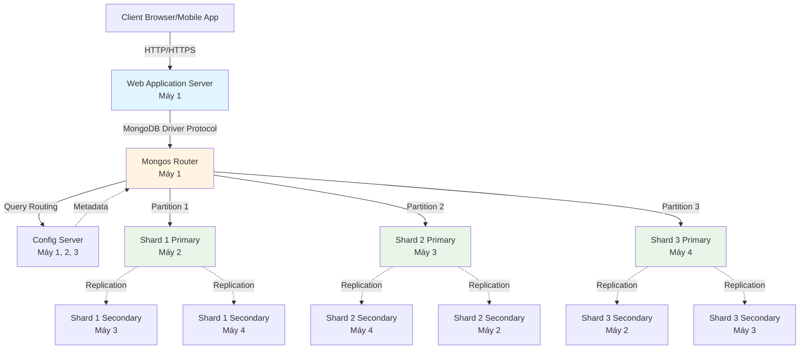

Collecting workspace information# PHẦN 3: CƠ CHẾ PHÂN TÁN

## 3.1. Kiến trúc Vật lý (Physical Topology)

### 3.1.1. Mô hình Triển khai 4-Node Cluster

Hệ thống được triển khai trên kiến trúc phân tán 4 máy chủ vật lý, mỗi máy đảm nhận vai trò chuyên biệt trong topology tổng thể:

**Máy 1 - Application & Routing Layer:**
Đóng vai trò Gateway của toàn bộ hệ thống, chịu trách nhiệm tiếp nhận và định tuyến các yêu cầu từ phía client. Máy này chạy các thành phần:
- **Web Application Server:** Backend Node.js/Express xử lý business logic.
- **Mongos Router:** Thành phần định tuyến MongoDB Sharded Cluster, chịu trách nhiệm phân tích query và forward đến Shard phù hợp dựa trên Shard Key.
- **Config Server Replica Set Member:** Lưu trữ metadata về cấu trúc phân mảnh (shard key ranges, chunk distribution).

**Máy 2, 3, 4 - Data Layer (Distributed Storage):**
Ba máy này tạo thành lớp lưu trữ phân tán, mỗi máy host một hoặc nhiều Shard Replica Set Members. Thiết kế này đảm bảo:
- **Data Locality:** Dữ liệu được lưu trữ gần với compute resources, giảm latency mạng.
- **Fault Isolation:** Sự cố trên một máy không ảnh hưởng đến khả năng xử lý của toàn hệ thống.
- **Resource Isolation:** CPU, RAM, Disk I/O của các Shard không cạnh tranh với nhau trên cùng một máy.

### 3.1.2. Sơ đồ Luồng Xử lý Yêu cầu



**Giải thích luồng xử lý:**

1. **Request Initiation:** Client gửi HTTP request đến Web Application Server trên Máy 1.
2. **Query Translation:** Application chuyển đổi business logic thành MongoDB queries.
3. **Routing Decision:** Mongos Router phân tích query, tham khảo metadata từ Config Server để xác định Shard(s) chứa dữ liệu cần thiết.
4. **Targeted Execution:** Query được forward đến Primary Node của Shard tương ứng trên Máy 2, 3, hoặc 4.
5. **Result Aggregation:** Mongos tổng hợp kết quả từ các Shard (nếu query span multiple shards) và trả về cho Application.
6. **Response Delivery:** Web App format dữ liệu và gửi HTTP response về Client.

### 3.1.3. Phân bố Vai trò theo Máy Vật lý

| **Máy**   | **Vai trò chính**                      | **Thành phần MongoDB**                          | **Chức năng**                                    |
|-----------|----------------------------------------|------------------------------------------------|--------------------------------------------------|
| **Máy 1** | Application & Routing Layer            | Mongos, Config Server (1/3)                    | Xử lý business logic, định tuyến query            |
| **Máy 2** | Data Layer - Shard Host                | Shard 1 Primary, Shard 2 Secondary, Shard 3 Secondary, Config Server (2/3) | Lưu trữ partition 1, backup partition 2 & 3       |
| **Máy 3** | Data Layer - Shard Host                | Shard 2 Primary, Shard 1 Secondary, Shard 3 Secondary, Config Server (3/3) | Lưu trữ partition 2, backup partition 1 & 3       |
| **Máy 4** | Data Layer - Shard Host                | Shard 3 Primary, Shard 1 Secondary, Shard 2 Secondary | Lưu trữ partition 3, backup partition 1 & 2       |

## 3.2. Chiến lược Phân mảnh (Sharding Strategy)

### 3.2.1. Hashed Sharding trên Collection `users`

Hệ thống áp dụng **Hashed Sharding** với Shard Key là `_id` để phân tán dữ liệu người dùng. Cơ chế hoạt động như sau:

**Thuật toán băm (Hash Function):**
Khi một document User mới được insert, MongoDB thực hiện:
1. Tính giá trị hash MD5 của trường `_id` (ObjectId 96-bit).
2. Ánh xạ hash value vào không gian shard key 64-bit.
3. Xác định chunk range chứa hash value đó.
4. Định tuyến document đến Shard quản lý chunk tương ứng.

**Ưu điểm của Hashed Sharding:**

- **Phân phối đồng đều:** Với hash function có tính chất avalanche (thay đổi nhỏ input gây thay đổi lớn output), dữ liệu được rải đều trên các Shard ngay cả khi `_id` có pattern tuần tự (ví dụ: ObjectId tăng dần theo thời gian).
- **Tránh Hotspot:** Không có Shard nào bị quá tải do nhận phần lớn write operations. Điều này quan trọng khi hệ thống có burst traffic (ví dụ: chiến dịch marketing khiến hàng ngàn user đăng ký cùng lúc).
- **Tự động Balancing:** MongoDB Balancer định kỳ di chuyển chunks giữa các Shard để duy trì phân phối cân bằng khi dữ liệu tăng trưởng.

**Trade-off:**
- **Không hỗ trợ Range Query hiệu quả:** Các query dạng "tìm users có `_id` từ X đến Y" sẽ phải broadcast đến tất cả Shard (scatter-gather pattern), giảm hiệu năng. Tuy nhiên, trong use case mạng xã hội, query pattern chủ yếu là point lookup (tìm user theo exact `_id`), nên trade-off này chấp nhận được.

### 3.2.2. Hashed Sharding trên Collection `posts`

Collection `posts` sử dụng Shard Key là `authorId` (ObjectId tham chiếu đến User `_id`) với Hashed Sharding:

**Lý do lựa chọn `authorId` thay vì `_id`:**

- **Data Locality cho User Operations:** Tất cả bài viết của một user sẽ được lưu trên cùng một Shard (vì cùng hash value của `authorId`). Điều này tối ưu query "Lấy tất cả posts của user X" - một trong những query phổ biến nhất trong hệ thống.
- **Write Distribution:** Vì `authorId` là ObjectId của User (đã được hash uniform), các post mới sẽ được phân phối đều trên các Shard, tránh write hotspot.

**Kịch bản minh họa:**
```
User A (ID: 507f1f77bcf86cd799439011) tạo 100 bài viết
→ Hash(507f1f77bcf86cd799439011) = 0x3A2F...BC 
→ Ánh xạ vào Chunk Range [0x3000...0000, 0x4000...0000]
→ Tất cả 100 posts đều được lưu trên Shard 2

Query "SELECT posts WHERE authorId = 507f1f77bcf86cd799439011"
→ Mongos chỉ cần route đến Shard 2 (Targeted Query)
→ Latency thấp, không cần scatter-gather
```

### 3.2.3. Phân tích Hiệu năng

| **Aspect**                | **Hashed Sharding**                          | **Range Sharding** (Không sử dụng)        |
|---------------------------|----------------------------------------------|------------------------------------------|
| **Write Distribution**    | Đồng đều trên tất cả Shard                   | Có thể tập trung vào 1 Shard (hotspot)   |
| **Point Query**           | Targeted (1 Shard)                           | Targeted (1 Shard)                       |
| **Range Query**           | Broadcast (Tất cả Shard)                     | Targeted (1-2 Shard)                     |
| **Auto-Balancing**        | Hiệu quả (dựa trên chunk count)             | Phức tạp (phụ thuộc data distribution)   |
| **Setup Complexity**      | Đơn giản (không cần phân tích data pattern)  | Phức tạp (cần chọn shard key ranges)     |

## 3.3. Cơ chế Đảm bảo Sẵn sàng cao (High Availability)

### 3.3.1. Cross-Machine Replication Architecture

Hệ thống áp dụng chiến lược **Cross-Machine Replication** để đảm bảo tính sẵn sàng cao. Cụ thể, mỗi Shard được cấu hình như một **Replica Set 3 thành viên** với các node nằm trên 3 máy vật lý khác nhau:

**Cấu hình Replica Set cho Shard 1:**
```
Shard 1 Primary      → Máy 2
Shard 1 Secondary 1  → Máy 3
Shard 1 Secondary 2  → Máy 4
```

**Cơ chế Replication:**

1. **Synchronous Write Propagation:** Khi Primary nhận write operation, nó ghi vào Oplog (operation log) và replicate đến các Secondary nodes.
2. **Write Concern Configuration:** Hệ thống sử dụng write concern `{w: "majority"}`, đảm bảo data chỉ được acknowledge khi đã replicate thành công đến majority (2/3) nodes. Điều này cân bằng giữa durability và performance.
3. **Heartbeat Mechanism:** Các nodes trong Replica Set gửi heartbeat mỗi 2 giây để detect node failures.

### 3.3.2. Kịch bản Chịu lỗi (Fault Tolerance Scenarios)

#### Kịch bản 1: Primary Node Failure

**Sự kiện:** Máy 2 (host Shard 1 Primary) bị mất điện đột ngột.

**Quy trình Automatic Failover:**
1. **Detection (10 giây):** Secondary nodes trên Máy 3 và Máy 4 không nhận được heartbeat từ Primary.
2. **Election Initiation:** Hai Secondary nodes bắt đầu election process.
3. **New Primary Election (5-10 giây):** Node trên Máy 3 được bầu làm Primary mới (dựa trên priority và data freshness).
4. **Reconnection (Sau 15-20 giây):** Mongos tự động phát hiện topology change và redirect traffic đến Primary mới.
5. **Client Impact:** Application có downtime 15-20 giây cho các operations liên quan đến Shard 1.

**Khi Máy 2 khôi phục:**
- Node cũ tự động rejoin Replica Set với vai trò Secondary.
- Thực hiện sync từ Primary mới để catch up những operations bị miss.

#### Kịch bản 2: Toàn bộ Máy Vật lý bị hỏng

**Sự kiện:** Máy 4 bị hardware failure nghiêm trọng (ổ cứng chết).

**Phân tích Impact:**
```
Shard 1: Mất 1/3 replicas → Vẫn hoạt động (2/3 còn lại trên Máy 2, 3)
Shard 2: Mất 1/3 replicas → Vẫn hoạt động (2/3 còn lại trên Máy 2, 3)
Shard 3: Mất Primary    → Auto-failover, Secondary trên Máy 2 hoặc 3 lên làm Primary
```

**Kết quả:**
- **Zero Data Loss:** Vì write concern `majority` đảm bảo data đã có trên ít nhất 2 nodes trước khi acknowledge.
- **Reduced Redundancy:** Hệ thống vẫn hoạt động nhưng chỉ còn 2/3 replicas, giảm khả năng chịu lỗi thêm.
- **Cảnh báo Vận hành:** Monitoring system phát cảnh báo, yêu cầu thay thế Máy 4 trong vòng 24-48 giờ.

### 3.3.3. Lợi ích Kỹ thuật của Cross-Machine Replication

**Tách biệt Điểm Lỗi (Failure Isolation):**
Các bản sao dữ liệu nằm trên máy vật lý khác nhau, trong data center khác nhau (nếu có), đảm bảo một sự cố cục bộ (cháy, lũ, mất điện) không làm mất toàn bộ dữ liệu.

**Zero Downtime Maintenance:**
Có thể shutdown từng máy để bảo trì (update OS, thay hardware) mà không ảnh hưởng đến hoạt động của hệ thống:
```
Bước 1: Shutdown Máy 4 → Shard 3 auto-failover, system vẫn hoạt động
Bước 2: Upgrade Máy 4 → Rejoin cluster
Bước 3: Lặp lại cho Máy 2, 3
```

**Geographic Distribution (Mở rộng tương lai):**
Kiến trúc này dễ dàng scale lên mô hình Multi-Region:
- Primary ở Region A (latency thấp cho local users).
- Secondary 1 ở Region B (disaster recovery).
- Secondary 2 ở Region C (read scalability cho users ở châu lục khác).

### 3.3.4. Bảng so sánh Độ sẵn sàng theo Số lượng Replicas

| **Cấu hình**      | **Số Replica** | **Chịu lỗi tối đa** | **Uptime SLA**  | **Write Latency** |
|-------------------|----------------|---------------------|-----------------|-------------------|
| Standalone        | 1              | 0 nodes             | ~95%            | Thấp nhất         |
| Replica Set (2)   | 2              | 0 nodes*            | ~99%            | Trung bình        |
| Replica Set (3)   | 3              | 1 node              | ~99.95%         | Trung bình        |
| Replica Set (5)   | 5              | 2 nodes             | ~99.99%         | Cao hơn           |

*Lưu ý: Replica Set 2 nodes không đảm bảo automatic failover (cần quorum 2/2 để elect Primary mới, nhưng nếu 1 node chết thì chỉ còn 1/2).

**Kết luận:** Dự án lựa chọn cấu hình Replica Set 3 nodes + Cross-Machine Distribution, đạt được điểm cân bằng tối ưu giữa chi phí infrastructure, độ phức tạp vận hành, và mức độ sẵn sàng (High Availability ~99.95%).